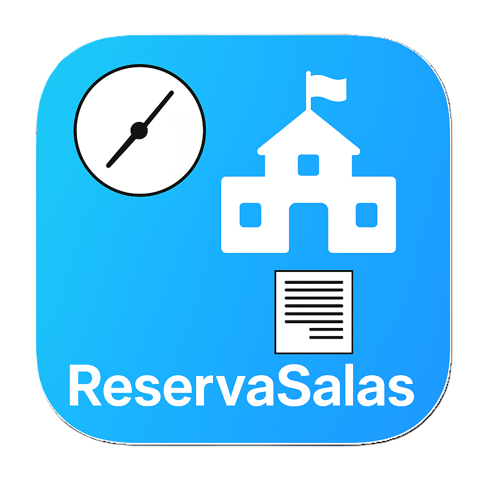

# ClassLink

Programa para Reservar Salas no AEJICS. 

Adaptado para PAP (Prova de Aptidão Profissional). 
Livre para qualquer pessoa modificar. Pedimos para quem deseja modificar, que leia o [CONTRIBUIDORES.md](CONTRIBUIDORES.md).

## Instalação

- Necessário um servidor com PHP e uma DB MariaDB
- Composer (para o Windows, descarregar [esta versão](https://getcomposer.org/Composer-Setup.exe))
- Com o composer, fazer `composer install` através de um terminal, para instalar as dependências.
- Montar o utilizador usando as instruções [na wiki](https://github.com/aejics/ClassLink/wiki/Configura%C3%A7%C3%A3o-MYSQL) (brevemente haverá mais documentação na Wiki)

## Documentação

A documentação irá estar presente na [Wiki](https://github.com/aejics/ClassLink/wiki/). Neste momento em TBD (_to be done_) e apenas coisas importantes para o desenvolvimento lá mencionada.

## Menções especiais
- Marco Pisco - Gestão do Projeto
- Prof. André Gaspar - Ideia do projeto, gestão do projeto, dedicar aulas deles para podermos criar este projeto.
- Turma 3.º D - Ajuda com front-end designing, e qualquer tipo de inspiração.
- [@juoum](https://github.com/itsjuoum/) - Pela escrita da bibilioteca maravilhosa do [GIAEConnect](https://github.com/itsjuoum/GIAEConnect), a biblioteca que permite a conexão ao GIAE, na primeira versão do Reserva Salas.
