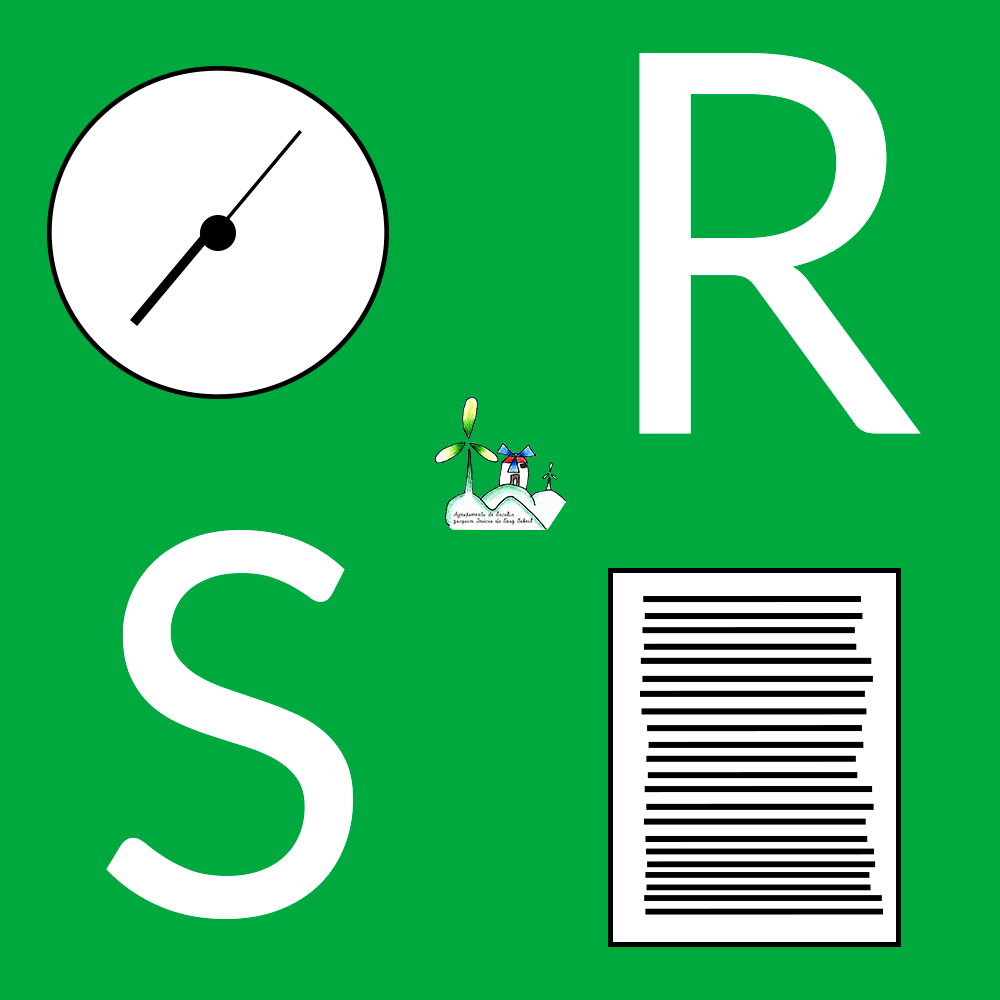

# Reserva de Salas

Programa para Reservar Salas no AEJICS.

Este projeto é possível graças aos trabalhos das seguintes turmas:

- 1ºD - Design de Funcionalidades Possíveis para a Aplicação
- 2ºE - Criação das Expressões para o Backend SQL, e criação da aplicação.

# ⚠️ Aviso! Em desenvolvimento!
Enquanto este código está estável o suficiente para ser usado por utilizadores, irão sempre ser adicionadas funcionalidades novas e talvez sejam removidas algumas funcionalidades.

Caso descubra um Bug, agradecemos que seja criado um pull request ou uma issue pelos separadores do topo do GitHub :)

## Instalação

- Necessário um servidor com PHP
- Composer (para o Windows, descarregar [esta versão](https://getcomposer.org/Composer-Setup.exe))
- Com o composer, fazer `composer install` através de um terminal.

## Créditos
- Marco Pisco - Escrita da Aplicação
- [@juoum](https://github.com/itsjuoum/) - Pela escrita da bibilioteca maravilhosa do [GIAEConnect](https://github.com/itsjuoum/GIAEConnect), a biblioteca que permite a conexão ao GIAE.
